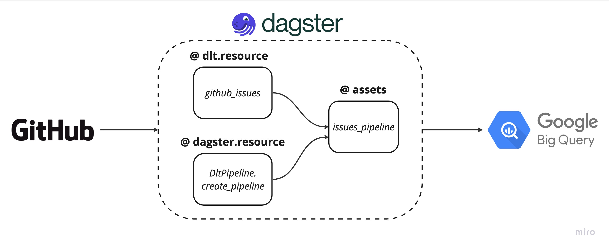

# Orchestrating unstructured data pipeline with dagster and dlt.

This is demo project to show how to orchestrate dlt data pipelines using dagster. In this demo, we create two data pipelines:
1. **GitHub Issues:** A data pipeline to extract issues data from a github repository and ingest the data into Google BigQuery. 
2. **MongoDB:** A data pipeline to extract unstructures data from MongoDB and ingest the data into BigQuery.

The demo uses [dlt](https://github.com/dlt-hub/dlt) create a pipeline and orchestrates it using [dagster](https://github.com/dagster-io/dagster).

The diagram above illustrates the dlt data pipeline being orchestrated using dagster:
1. A dlt resource (github_issues) yields the data from the GitHub API and passes the data to a dagster asset.
2. A dagster configurable resource (Class: DltResource) which has a create_pipeline pipeline.
3. A dagster asset that takes the configurable resource (Class: DltResource) and dlt resource (github_issues) to execute the pipeline.

## How to run the pipeline
The repo consists of two seperate dagster projects:
- github-issues
- mongodb_dlt

The steps to run the projects are the same for both:
1. Clone this repository.
2. Create a Python virtual environment with `python -m venv venv` and activate it with `source venv/bin/activate`.
3. ``cd`` to the project you want to run.
4. Install the dependencies with `pip install -r requirements.txt`.
5. Create a ``.env`` file in the root directory of the project and add the relevant credentials:
    - github-issues: BigQuery
    - mongodb_dlt: BigQuery and MongoDB Atlas
6. Start the dagster web server with `dagster dev` and materialize the assets.